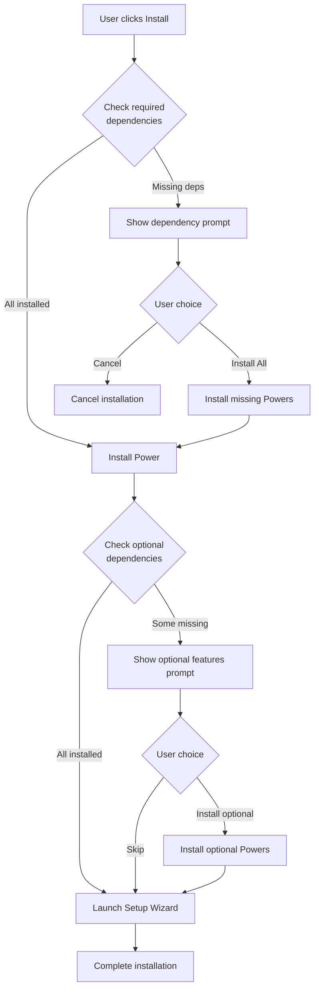
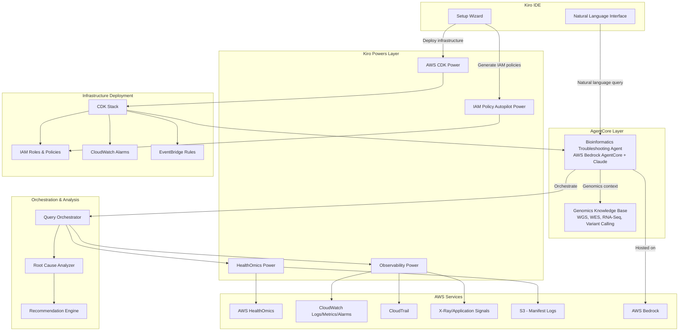

# Design Document: Genomic Workflow Observability System

## Project Information

- **Project Name**: Genomic Workflow Observability System
- **Kiro Power Name**: HealthOmics AI Troubleshooter
- **Package Name**: healthomics-ai-troubleshooter
- **CDK Stack Name**: HealthOmicsAITroubleshooterStack
- **AgentCore Agent Name**: HealthOmicsWorkflowTroubleshooter
- **Development Repository**: Private (YOUR-USERNAME/aws-healthomics-ai-troubleshooting-assistant)
- **Target Public Repository**: github.com/aws-samples/aws-healthomics-ai-troubleshooting-assistant

## Overview

The Genomic Workflow Observability System is an AI-assisted troubleshooting platform integrated into Kiro IDE that enables bioinformatics engineers to diagnose and resolve AWS HealthOmics workflow failures through natural language queries. The system uses a specialized AI agent built on AWS Bedrock AgentCore with genomics domain knowledge to correlate data from AWS HealthOmics, CloudWatch, CloudTrail, and X-Ray, providing root cause analysis and actionable recommendations. The system reduces troubleshooting time from hours to minutes and provides turnkey deployment through AWS CDK with automated IAM policy management.

### Key Design Principles

1. **Single Pane of Glass**: All troubleshooting activities occur within Kiro IDE without context switching
2. **Intelligent Correlation**: Automatically link data across multiple AWS services to identify root causes
3. **Actionable Insights**: Provide specific parameter values and configuration changes, not generic advice
4. **Progressive Disclosure**: Start with high-level summaries and allow users to drill down into details
5. **Resilient by Default**: Handle partial data availability and API failures gracefully
6. **Domain-Specific Intelligence**: Leverage genomics-specific knowledge for bioinformatics-relevant recommendations
7. **Turnkey Deployment**: Enable one-command infrastructure deployment with automated IAM configuration
8. **Community Reusability**: Support shared agent deployment for team-wide troubleshooting capabilities
9. **Modular Dependencies**: Declare Power dependencies explicitly to enable future extensibility and optional enhancements

## Power Dependency Architecture

The solution is distributed as a **Kiro Power with declared dependencies** on other Powers. This modular approach enables:

- Future addition of new Power dependencies without breaking existing installations
- Optional Powers that enhance functionality but aren't required
- Clear separation of concerns between components
- Reuse of existing community Powers

### Power Manifest Structure

```yaml
name: healthomics-ai-troubleshooter
displayName: HealthOmics AI Troubleshooter
version: 1.0.0
description: AI-assisted troubleshooting for AWS HealthOmics genomic workflows with custom knowledge base support
author: Avinash Gogineni
repository: https://github.com/aws-samples/aws-healthomics-ai-troubleshooting-assistant
package: "healthomics-ai-troubleshooter"

# Required dependencies - must be installed
dependencies:
  required:
    - name: aws-healthomics
      version: ">=1.0.0"
      reason: "Provides HealthOmics API access for workflow run data"
    - name: aws-observability
      version: ">=1.0.0"
      reason: "Provides CloudWatch, CloudTrail, and X-Ray integration"
    - name: aws-agentcore
      version: ">=1.0.0"
      reason: "Provides AgentCore agent deployment and management capabilities (REQUIRED for AI agent)"
    - name: iam-policy-autopilot-power
      version: ">=1.0.0"
      reason: "Automates IAM policy generation and deployment"
    - name: aws-infrastructure-as-code
      version: ">=1.0.0"
      reason: "Provides CDK deployment and validation capabilities"

  # Optional dependencies - enhance functionality
  optional:
    - name: future-genomics-analytics-power
      version: ">=1.0.0"
      reason: "Placeholder for future genomics-specific analytics enhancements"
      features: ["Advanced variant analysis", "Population genetics insights"]
    - name: future-cost-optimization-power
      version: ">=1.0.0"
      reason: "Placeholder for future cost optimization recommendations"
      features: ["Spot instance recommendations", "Resource right-sizing"]

# Installation behavior
installation:
  checkDependencies: true
  promptForMissing: true
  allowPartialInstall: false # Require all dependencies
  autoInstallDependencies: false # User must confirm

# Agent configuration
agent:
  name: HealthOmicsWorkflowTroubleshooter
  modelId: "anthropic.claude-3-5-sonnet-20241022-v2:0"

# CDK configuration
infrastructure:
  stackName: HealthOmicsAITroubleshooterStack
  defaultRegion: us-east-1
```

### Dependency Installation Flow



### Graceful Degradation for Optional Powers

When optional Powers are not installed:

- **future-genomics-analytics-power missing**: Advanced variant analysis features disabled, core troubleshooting works normally
- **future-cost-optimization-power missing**: Cost optimization recommendations not available, core troubleshooting works normally
- **Future optional Powers**: System operates with core functionality, displays message about available enhancements

## Architecture

The system follows a layered architecture integrated with Kiro's existing Powers framework and AWS Bedrock AgentCore:



### Architecture Layers

1. **User Interface Layer**: Natural language query interface and setup wizard in Kiro IDE
2. **AgentCore Layer**: Specialized bioinformatics AI agent with genomics domain knowledge
3. **Powers Layer**: Kiro Power implementations for AWS service integration and deployment automation
4. **Orchestration & Analysis Layer**: Data retrieval coordination, root cause identification, and recommendation generation
5. **AWS Services Layer**: External AWS APIs and data sources
6. **Infrastructure Deployment Layer**: Automated provisioning of AWS resources via CDK

## Components and Interfaces

### 1. Bioinformatics Troubleshooting Agent (AgentCore)

**Purpose**: Specialized AI agent with genomics domain knowledge that orchestrates troubleshooting workflows and provides bioinformatics-specific recommendations.

**Interface**:

```typescript
interface BioinformaticsAgent {
  // Agent lifecycle
  initialize(config: AgentConfiguration): Promise<void>;
  deploy(): Promise<AgentDeployment>;

  // Query handling
  processQuery(query: string, userId: string): Promise<AgentResponse>;
  maintainContext(userId: string, context: ConversationContext): void;

  // Tool orchestration
  invokeTool(toolName: string, parameters: Record<string, any>): Promise<any>;
}

interface AgentConfiguration {
  agentName: string;
  modelId: string; // e.g., "anthropic.claude-3-5-sonnet-20241022-v2:0"
  instruction: string; // System prompt with genomics knowledge
  tools: AgentTool[];
  knowledgeBase?: KnowledgeBaseConfig;
  memory?: MemoryConfig;
  guardrails?: GuardrailConfig;
}

interface AgentTool {
  name: string;
  description: string;
  inputSchema: Record<string, any>;
  handler: (input: any) => Promise<any>;
}

interface KnowledgeBaseConfig {
  // Base genomics knowledge
  baseKnowledgeBaseId: string; // Pre-built genomics knowledge

  // Custom organization knowledge
  customKnowledgeSources: string[]; // IDs of custom knowledge sources
  knowledgeBaseNamespaces: string[]; // Namespaces to search

  // Retrieval configuration
  retrievalConfiguration: {
    vectorSearchConfiguration: {
      numberOfResults: number;
      overrideSearchType?: "HYBRID" | "SEMANTIC";
    };
  };

  // Priority configuration
  prioritizeCustomKnowledge: boolean; // Prefer org-specific over generic
}

interface MemoryConfig {
  memoryId: string;
  strategies: MemoryStrategy[];
  eventExpiryDays: number;
  enableSemanticExtraction: boolean;
}

interface AgentResponse {
  message: string;
  rootCauseAnalysis?: RootCauseAnalysis;
  recommendations?: Recommendation[];
  conversationId: string;
  traceId?: string;
}

interface AgentDeployment {
  agentId: string;
  agentArn: string;
  agentVersion: string;
  status: "CREATING" | "ACTIVE" | "FAILED";
}

interface ConversationContext {
  conversationId: string;
  workflowRunId?: string;
  previousQueries: string[];
  analysisHistory: RootCauseAnalysis[];
}
```

**Key Behaviors**:

- Maintains genomics-specific knowledge (WGS, WES, RNA-Seq, variant calling workflows)
- Understands bioinformatics tools (GATK, BWA-MEM2, Samtools, Picard)
- Recognizes common failure patterns in genomic pipelines
- Provides domain-specific recommendations (not generic AWS advice)
- Orchestrates calls to HealthOmics Power and Observability Power
- Maintains separate conversation contexts for multiple concurrent users

**Genomics Knowledge Base Content**:

- Common workflow types and their typical resource requirements
- Bioinformatics tool error messages and their meanings
- Best practices for genomic data processing
- Typical failure modes for variant calling, alignment, and QC steps
- Reference genome considerations and common pitfalls

### 2. Setup Wizard

**Purpose**: Guide users through initial system configuration and deployment with minimal manual steps.

**Interface**:

```typescript
interface SetupWizard {
  // Wizard flow
  start(): Promise<SetupSession>;
  collectConfiguration(session: SetupSession): Promise<SystemConfiguration>;
  validateConfiguration(config: SystemConfiguration): Promise<ValidationResult>;
  deployInfrastructure(config: SystemConfiguration): Promise<DeploymentResult>;
  testConnectivity(config: SystemConfiguration): Promise<ConnectivityTest>;
  complete(session: SetupSession): Promise<void>;
}

interface SetupSession {
  sessionId: string;
  currentStep: SetupStep;
  configuration: Partial<SystemConfiguration>;
  validationErrors: string[];
}

enum SetupStep {
  WELCOME = "WELCOME",
  AWS_CREDENTIALS = "AWS_CREDENTIALS",
  REGION_SELECTION = "REGION_SELECTION",
  S3_CONFIGURATION = "S3_CONFIGURATION",
  NOTIFICATION_PREFERENCES = "NOTIFICATION_PREFERENCES",
  IAM_POLICY_GENERATION = "IAM_POLICY_GENERATION",
  CDK_DEPLOYMENT = "CDK_DEPLOYMENT",
  CONNECTIVITY_TEST = "CONNECTIVITY_TEST",
  COMPLETE = "COMPLETE",
}

interface ValidationResult {
  valid: boolean;
  errors: ValidationError[];
  warnings: ValidationWarning[];
}

interface ValidationError {
  field: string;
  message: string;
  remediation: string;
}

interface DeploymentResult {
  success: boolean;
  stackId?: string;
  agentId?: string;
  resources: DeployedResource[];
  errors?: string[];
}

interface DeployedResource {
  type: string;
  id: string;
  arn: string;
  status: string;
}

interface ConnectivityTest {
  healthOmicsAccess: boolean;
  cloudWatchAccess: boolean;
  cloudTrailAccess: boolean;
  s3Access: boolean;
  agentAccess: boolean;
  errors: string[];
}
```

**Key Behaviors**:

- Presents step-by-step configuration wizard in Kiro IDE
- Validates AWS credentials before proceeding
- Offers one-click CDK deployment
- Offers one-click IAM policy generation via IAM Policy Autopilot
- Tests connectivity to all required AWS services
- Provides clear error messages and remediation steps
- Persists configuration for future sessions

### 3. CDK Deployment Manager

**Purpose**: Automate infrastructure provisioning using AWS CDK with validation and compliance checking.

**Interface**:

```typescript
interface CDKDeploymentManager {
  // Stack management
  synthesizeStack(config: SystemConfiguration): Promise<CDKStack>;
  validateStack(stack: CDKStack): Promise<ValidationResult>;
  deployStack(stack: CDKStack): Promise<DeploymentResult>;
  rollbackStack(stackId: string): Promise<void>;

  // Resource management
  createAgentCoreAgent(config: AgentConfiguration): Promise<string>;
  createIAMRoles(permissions: IAMPermission[]): Promise<string[]>;
  createCloudWatchAlarms(alarmConfigs: AlarmConfiguration[]): Promise<string[]>;
  createEventBridgeRules(
    ruleConfigs: EventBridgeRuleConfiguration[],
  ): Promise<string[]>;
  createS3Buckets(bucketConfigs: S3BucketConfiguration[]): Promise<string[]>;
}

interface CDKStack {
  stackName: string;
  template: string; // CloudFormation template JSON
  parameters: Record<string, string>;
  tags: Record<string, string>;
}

interface AlarmConfiguration {
  alarmName: string;
  metricName: string;
  namespace: string;
  threshold: number;
  comparisonOperator: string;
  evaluationPeriods: number;
  actions: string[]; // SNS topic ARNs
}

interface EventBridgeRuleConfiguration {
  ruleName: string;
  eventPattern: Record<string, any>;
  targets: EventBridgeTarget[];
}

interface EventBridgeTarget {
  targetType: "LAMBDA" | "SNS" | "SQS";
  targetArn: string;
}

interface S3BucketConfiguration {
  bucketName: string;
  lifecycleRules: S3LifecycleRule[];
  encryption: boolean;
  versioning: boolean;
}

interface S3LifecycleRule {
  id: string;
  prefix: string;
  expirationDays: number;
  transitions: S3Transition[];
}

interface S3Transition {
  storageClass: string;
  days: number;
}
```

**Key Behaviors**:

- Generates CDK code for all required infrastructure
- Validates CloudFormation templates before deployment
- Checks security compliance using AWS CDK Power
- Supports parameterization for different environments (dev, staging, prod)
- Provides rollback capability on deployment failure
- Tags all resources for cost tracking and governance

### 4. IAM Policy Autopilot Integration

**Purpose**: Automatically analyze code and generate least-privilege IAM policies.

**Interface**:

```typescript
interface IAMPolicyAutopilot {
  // Policy generation
  analyzeCodeForPermissions(codePaths: string[]): Promise<IAMPermission[]>;
  generatePolicy(permissions: IAMPermission[]): Promise<IAMPolicyDocument>;
  validatePolicy(policy: IAMPolicyDocument): Promise<PolicyValidationResult>;
  deployPolicy(policy: IAMPolicyDocument, roleArn: string): Promise<void>;

  // Permission management
  detectMissingPermissions(error: AWSError): IAMPermission | null;
  suggestPermissionFix(permission: IAMPermission): string;
}

interface IAMPermission {
  service: string; // e.g., "omics", "logs", "cloudtrail"
  action: string; // e.g., "GetRun", "StartQuery", "LookupEvents"
  resource: string; // ARN or "*"
  condition?: Record<string, any>;
}

interface IAMPolicyDocument {
  Version: string;
  Statement: IAMPolicyStatement[];
}

interface IAMPolicyStatement {
  Effect: "Allow" | "Deny";
  Action: string[];
  Resource: string[];
  Condition?: Record<string, any>;
}

interface PolicyValidationResult {
  valid: boolean;
  errors: string[];
  warnings: string[];
  suggestions: string[];
}

interface AWSError {
  code: string;
  message: string;
  statusCode: number;
}
```

**Key Behaviors**:

- Scans TypeScript code to identify AWS SDK calls
- Generates IAM policies with least-privilege permissions
- Validates policies against AWS IAM policy grammar
- Detects missing permissions from AWS error responses
- Provides remediation instructions for permission errors
- Supports both single-account and cross-account scenarios

### 5. Custom Knowledge Base Manager

**Purpose**: Enable organizations to customize the agent with their own documentation, troubleshooting patterns, and historical data.

**Interface**:

```typescript
interface KnowledgeBaseManager {
  // Knowledge source management
  addKnowledgeSource(source: KnowledgeSource): Promise<KnowledgeSourceResult>;
  updateKnowledgeSource(
    sourceId: string,
    source: Partial<KnowledgeSource>,
  ): Promise<void>;
  removeKnowledgeSource(sourceId: string): Promise<void>;
  listKnowledgeSources(): Promise<KnowledgeSource[]>;

  // Data ingestion
  ingestDocuments(
    sourceId: string,
    documents: Document[],
  ): Promise<IngestionResult>;
  ingestFromSharePoint(config: SharePointConfig): Promise<IngestionResult>;
  ingestFromConfluence(config: ConfluenceConfig): Promise<IngestionResult>;
  ingestHistoricalData(
    data: HistoricalTroubleshootingData[],
  ): Promise<IngestionResult>;

  // Knowledge base operations
  searchKnowledgeBase(
    query: string,
    namespace?: string,
  ): Promise<KnowledgeSearchResult[]>;
  validateKnowledgeBase(): Promise<ValidationResult>;
  getKnowledgeBaseMetrics(): Promise<KnowledgeBaseMetrics>;

  // Memory integration
  createMemoryNamespace(
    namespace: string,
    strategy: MemoryStrategy,
  ): Promise<string>;
  configureSemanticExtraction(config: SemanticExtractionConfig): Promise<void>;
}

interface KnowledgeSource {
  id: string;
  name: string;
  type: KnowledgeSourceType;
  namespace: string; // e.g., "/org/runbooks/", "/org/troubleshooting-history/"
  configuration: KnowledgeSourceConfig;
  status: "ACTIVE" | "INDEXING" | "FAILED" | "DISABLED";
  lastUpdated: Date;
  documentCount: number;
}

enum KnowledgeSourceType {
  SHAREPOINT = "SHAREPOINT",
  CONFLUENCE = "CONFLUENCE",
  FILE_SYSTEM = "FILE_SYSTEM",
  S3_BUCKET = "S3_BUCKET",
  WIKI = "WIKI",
  HISTORICAL_LOGS = "HISTORICAL_LOGS",
  CUSTOM_API = "CUSTOM_API",
}

interface KnowledgeSourceConfig {
  // Common fields
  refreshInterval?: number; // Hours between automatic updates
  includePatterns?: string[]; // File/page patterns to include
  excludePatterns?: string[]; // File/page patterns to exclude

  // Source-specific fields
  sharePoint?: SharePointConfig;
  confluence?: ConfluenceConfig;
  fileSystem?: FileSystemConfig;
  s3?: S3Config;
}

interface SharePointConfig {
  siteUrl: string;
  libraryName: string;
  folderPath?: string;
  authentication: {
    type: "OAUTH" | "SERVICE_PRINCIPAL";
    credentials: Record<string, string>;
  };
}

interface ConfluenceConfig {
  baseUrl: string;
  spaceKey: string;
  authentication: {
    type: "BASIC" | "OAUTH" | "PAT";
    credentials: Record<string, string>;
  };
}

interface FileSystemConfig {
  basePath: string;
  fileExtensions: string[]; // e.g., [".md", ".txt", ".pdf"]
  recursive: boolean;
}

interface S3Config {
  bucket: string;
  prefix: string;
  region: string;
}

interface Document {
  id: string;
  title: string;
  content: string;
  metadata: DocumentMetadata;
  source: string;
}

interface DocumentMetadata {
  author?: string;
  createdDate?: Date;
  modifiedDate?: Date;
  tags?: string[];
  category?: string;
  customFields?: Record<string, any>;
}

interface HistoricalTroubleshootingData {
  workflowRunId: string;
  failureType: string;
  rootCause: string;
  resolution: string;
  resolutionTime: number; // Minutes
  timestamp: Date;
  workflowType: WorkflowType;
  taskName?: string;
}

interface IngestionResult {
  success: boolean;
  documentsProcessed: number;
  documentsFailed: number;
  indexingJobId?: string;
  errors?: string[];
}

interface KnowledgeSearchResult {
  documentId: string;
  title: string;
  snippet: string;
  relevanceScore: number;
  namespace: string;
  source: string;
}

interface KnowledgeBaseMetrics {
  totalDocuments: number;
  documentsBySource: Record<string, number>;
  documentsByNamespace: Record<string, number>;
  lastIndexingTime: Date;
  queriesUsingCustomKnowledge: number;
  averageRelevanceScore: number;
}

interface MemoryStrategy {
  type: "SEMANTIC" | "USER_PREFERENCE" | "EVENT";
  name: string;
  namespaces: string[];
  extractionPrompt?: string;
}

interface SemanticExtractionConfig {
  enabled: boolean;
  extractionModel: string;
  chunkSize: number;
  chunkOverlap: number;
  embeddingModel: string;
}

interface KnowledgeSourceResult {
  sourceId: string;
  status: string;
  message: string;
}
```

**Key Behaviors**:

- Supports multiple data source types (SharePoint, Confluence, file systems, S3, wikis)
- Automatically indexes and extracts semantic information from documents
- Uses AgentCore Memory with semantic memory strategies for intelligent extraction
- Supports namespace organization for different knowledge categories
- Provides incremental updates without full re-indexing
- Validates knowledge base integrity and searchability
- Tracks usage metrics to measure knowledge base effectiveness
- Allows administrators to manage knowledge sources through UI or API
- Integrates with AgentCore Memory for persistent storage and retrieval

**Knowledge Base Architecture**:

1. **Ingestion Layer**: Connectors for various data sources (SharePoint, Confluence, etc.)
2. **Processing Layer**: Document parsing, chunking, and semantic extraction
3. **Storage Layer**: AgentCore Memory with semantic memory strategies
4. **Retrieval Layer**: Semantic search with relevance scoring
5. **Management Layer**: UI and API for knowledge source administration

**Supported Data Sources**:

- **SharePoint**: Document libraries, lists, and pages
- **Confluence**: Spaces, pages, and attachments
- **File Systems**: Local or network file shares (Markdown, PDF, Word, text files)
- **S3 Buckets**: Structured or unstructured documents
- **Internal Wikis**: Custom wiki platforms via API
- **Historical Logs**: Past troubleshooting sessions and resolutions
- **Custom APIs**: Organization-specific data sources

### 6. Natural Language Query Parser

**Purpose**: Parse user queries to extract intent, workflow identifiers, and time ranges.

**Interface**:

```typescript
interface QueryParser {
  parse(query: string): ParsedQuery;
}

interface ParsedQuery {
  intent: QueryIntent;
  workflowRunId?: string;
  timeRange?: TimeRange;
  taskName?: string;
  clarificationNeeded: boolean;
  clarificationPrompt?: string;
}

enum QueryIntent {
  GET_RUN_STATUS,
  ANALYZE_FAILURE,
  GET_TASK_DETAILS,
  LIST_RECENT_RUNS,
  GET_RECOMMENDATIONS,
}

interface TimeRange {
  start: Date;
  end: Date;
}
```

**Key Behaviors**:

- Extract workflow run IDs from patterns like "omics-abc123", "run abc123", or "workflow abc123"
- Parse relative time expressions: "last run", "runs in the past hour", "today's failures"
- Identify task names when mentioned explicitly
- Request clarification when multiple interpretations are possible

### 2. HealthOmics Power

**Purpose**: Provide access to AWS HealthOmics APIs and Run Analyzer data.

**Interface**:

```typescript
interface HealthOmicsPower {
  // Workflow run operations
  getRun(runId: string): Promise<WorkflowRun>;
  listRuns(filter: RunFilter): Promise<WorkflowRun[]>;

  // Task operations
  listRunTasks(runId: string): Promise<Task[]>;
  getTaskDetails(runId: string, taskId: string): Promise<TaskDetails>;

  // Resource utilization
  getRunAnalyzerData(runId: string): Promise<RunAnalyzerData>;

  // CloudWatch Logs (all log types)
  getRunLogs(runId: string, realTime?: boolean): Promise<LogStream>;
  getTaskLogs(
    runId: string,
    taskId: string,
    realTime?: boolean,
  ): Promise<LogStream>;
  getEngineLogs(runId: string): Promise<LogStream>; // Failed runs only
  getRunCacheLogs(runCacheId: string): Promise<LogStream>;

  // S3 Logs
  getManifestLogLocation(runId: string): Promise<S3Location>;
  readManifestLog(location: S3Location, taskId?: string): Promise<string>;
  getEngineLogFromS3(runId: string, outputUri: string): Promise<string>;
  getOutputsJson(runId: string, outputUri: string): Promise<WorkflowOutputs>; // WDL/CWL only

  // CloudWatch Metrics
  getHealthOmicsMetrics(
    params: HealthOmicsMetricsParams,
  ): Promise<MetricDataPoint[]>;
  getAPICallMetrics(
    operation: string,
    timeRange: TimeRange,
  ): Promise<MetricDataPoint[]>;

  // EventBridge Events
  subscribeToRunStatusEvents(callback: (event: RunStatusEvent) => void): void;
  getRunStatusHistory(runId: string): Promise<RunStatusEvent[]>;
}

interface WorkflowRun {
  id: string;
  name: string;
  status: RunStatus;
  workflowType: WorkflowType;
  startTime: Date;
  endTime?: Date;
  failureReason?: string;
  parameters: Record<string, any>;
  outputUri: string;
  logLevel: LogLevel;
}

enum RunStatus {
  PENDING = "PENDING",
  STARTING = "STARTING",
  RUNNING = "RUNNING",
  COMPLETED = "COMPLETED",
  FAILED = "FAILED",
  CANCELLED = "CANCELLED",
}

enum WorkflowType {
  NEXTFLOW = "NEXTFLOW",
  WDL = "WDL",
  CWL = "CWL",
}

interface Task {
  taskId: string;
  name: string;
  status: TaskStatus;
  startTime: Date;
  endTime?: Date;
  cpus: number;
  memory: number;
  gpus?: number;
}

enum TaskStatus {
  PENDING = "PENDING",
  RUNNING = "RUNNING",
  COMPLETED = "COMPLETED",
  FAILED = "FAILED",
  CANCELLED = "CANCELLED",
}

interface TaskDetails extends Task {
  exitCode?: number;
  logStreamName: string;
  instanceType?: string;
  spotInstance: boolean;
}

interface RunAnalyzerData {
  runId: string;
  tasks: TaskResourceMetrics[];
  recommendations: ResourceRecommendation[];
}

interface TaskResourceMetrics {
  taskId: string;
  taskName: string;
  cpuUtilization: ResourceUtilization;
  memoryUtilization: ResourceUtilization;
  diskUtilization: ResourceUtilization;
  duration: number;
}

interface ResourceUtilization {
  allocated: number;
  peak: number;
  average: number;
  unit: string;
}

interface ResourceRecommendation {
  taskName: string;
  resourceType: "CPU" | "MEMORY" | "DISK";
  currentValue: number;
  recommendedValue: number;
  reason: string;
}

interface S3Location {
  bucket: string;
  key: string;
}

interface RunFilter {
  status?: RunStatus;
  startTimeAfter?: Date;
  startTimeBefore?: Date;
  name?: string;
  maxResults?: number;
}

interface LogStream {
  logGroupName: string;
  logStreamName: string;
  events: LogEvent[];
  nextToken?: string;
}

interface WorkflowOutputs {
  runId: string;
  workflowType: WorkflowType;
  outputs: Record<string, any>; // Parsed outputs.json content
  outputFiles: OutputFile[];
}

interface OutputFile {
  name: string;
  path: string;
  size: number;
  type: string;
}

interface HealthOmicsMetricsParams {
  metricName: string;
  dimensions?: Dimension[];
  startTime: Date;
  endTime: Date;
  period: number;
  statistics: string[];
}

interface RunStatusEvent {
  eventId: string;
  runId: string;
  previousStatus: RunStatus;
  currentStatus: RunStatus;
  timestamp: Date;
  details: Record<string, any>;
}
```

### 3. Observability Power

**Purpose**: Provide access to CloudWatch, CloudTrail, and X-Ray APIs.

**Interface**:

```typescript
interface ObservabilityPower {
  // CloudWatch Logs
  queryLogs(params: LogQueryParams): Promise<LogQueryResult>;
  getLogEvents(
    logGroup: string,
    logStream: string,
    filter?: LogFilter,
  ): Promise<LogEvent[]>;

  // Pre-built Log Insights queries
  executePrebuiltQuery(
    queryType: PrebuiltQueryType,
    runId: string,
  ): Promise<LogQueryResult>;
  listPrebuiltQueries(): PrebuiltQuery[];

  // CloudWatch Metrics
  getMetrics(params: MetricQueryParams): Promise<MetricDataPoint[]>;

  // CloudWatch Alarms
  describeAlarms(filter: AlarmFilter): Promise<Alarm[]>;
  getAlarmHistory(
    alarmName: string,
    startTime: Date,
    endTime: Date,
  ): Promise<AlarmHistoryItem[]>;

  // CloudTrail
  lookupEvents(params: CloudTrailLookupParams): Promise<CloudTrailEvent[]>;

  // X-Ray / Application Signals
  getTraceSummaries(params: TraceQueryParams): Promise<TraceSummary[]>;
  getTraceDetails(traceId: string): Promise<Trace>;
}

enum PrebuiltQueryType {
  OOM_ERRORS = "OOM_ERRORS",
  PERMISSION_DENIALS = "PERMISSION_DENIALS",
  IMAGE_PULL_FAILURES = "IMAGE_PULL_FAILURES",
  TASK_FAILURES = "TASK_FAILURES",
  RESOURCE_EXHAUSTION = "RESOURCE_EXHAUSTION",
  TIMEOUT_ERRORS = "TIMEOUT_ERRORS",
  S3_ACCESS_ERRORS = "S3_ACCESS_ERRORS",
}

interface PrebuiltQuery {
  type: PrebuiltQueryType;
  name: string;
  description: string;
  queryString: string;
  exampleUsage: string;
}

interface LogQueryParams {
  logGroupName: string;
  queryString: string;
  startTime: Date;
  endTime: Date;
  limit?: number;
}

interface LogQueryResult {
  status: "Complete" | "Running" | "Failed";
  results: LogRecord[];
  statistics?: QueryStatistics;
}

interface LogRecord {
  timestamp: Date;
  message: string;
  fields: Record<string, string>;
}

interface LogEvent {
  timestamp: Date;
  message: string;
  ingestionTime: Date;
}

interface LogFilter {
  startTime?: Date;
  endTime?: Date;
  filterPattern?: string;
}

interface MetricQueryParams {
  namespace: string;
  metricName: string;
  dimensions?: Dimension[];
  startTime: Date;
  endTime: Date;
  period: number;
  statistics: string[];
}

interface Dimension {
  name: string;
  value: string;
}

interface MetricDataPoint {
  timestamp: Date;
  value: number;
  unit: string;
}

interface AlarmFilter {
  alarmNames?: string[];
  stateValue?: "OK" | "ALARM" | "INSUFFICIENT_DATA";
  alarmNamePrefix?: string;
}

interface Alarm {
  alarmName: string;
  alarmDescription?: string;
  stateValue: "OK" | "ALARM" | "INSUFFICIENT_DATA";
  stateReason: string;
  stateUpdatedTimestamp: Date;
  metricName: string;
  namespace: string;
  dimensions: Dimension[];
}

interface AlarmHistoryItem {
  timestamp: Date;
  historyItemType: "ConfigurationUpdate" | "StateUpdate" | "Action";
  historySummary: string;
  historyData: string;
}

interface CloudTrailLookupParams {
  lookupAttributes?: LookupAttribute[];
  startTime?: Date;
  endTime?: Date;
  maxResults?: number;
}

interface LookupAttribute {
  attributeKey:
    | "EventName"
    | "Username"
    | "ResourceType"
    | "ResourceName"
    | "EventId";
  attributeValue: string;
}

interface CloudTrailEvent {
  eventId: string;
  eventName: string;
  eventTime: Date;
  username: string;
  resources?: Resource[];
  errorCode?: string;
  errorMessage?: string;
  cloudTrailEvent: string; // JSON string
}

interface Resource {
  resourceType: string;
  resourceName: string;
}

interface TraceQueryParams {
  startTime: Date;
  endTime: Date;
  filterExpression?: string;
}

interface TraceSummary {
  id: string;
  duration: number;
  responseTime: number;
  hasFault: boolean;
  hasError: boolean;
  hasThrottle: boolean;
  http?: HttpInfo;
  annotations?: Record<string, string>;
}

interface HttpInfo {
  httpURL: string;
  httpStatus: number;
  httpMethod: string;
}

interface Trace {
  id: string;
  duration: number;
  segments: Segment[];
}

interface Segment {
  id: string;
  name: string;
  startTime: Date;
  endTime: Date;
  http?: HttpInfo;
  error?: boolean;
  fault?: boolean;
  cause?: SegmentCause;
  subsegments?: Segment[];
}

interface SegmentCause {
  workingDirectory: string;
  exceptions: Exception[];
}

interface Exception {
  id: string;
  message: string;
  type: string;
  remote: boolean;
  stack: StackFrame[];
}

interface StackFrame {
  path: string;
  line: number;
  label: string;
}
```

### 4. Query Orchestrator

**Purpose**: Coordinate data retrieval from multiple sources based on query intent.

**Interface**:

```typescript
interface QueryOrchestrator {
  execute(parsedQuery: ParsedQuery): Promise<OrchestratedData>;
}

interface OrchestratedData {
  workflowRun?: WorkflowRun;
  tasks?: TaskDetails[];
  runAnalyzerData?: RunAnalyzerData;
  logs?: LogQueryResult;
  alarms?: Alarm[];
  cloudTrailEvents?: CloudTrailEvent[];
  traces?: TraceSummary[];
  manifestLogs?: string;
}
```

**Key Behaviors**:

- Execute data retrieval operations in parallel when possible
- Handle partial failures gracefully (e.g., if CloudTrail is unavailable, continue with other data)
- Cache results for repeated queries
- Implement timeout handling for slow API calls

### 5. Root Cause Analyzer

**Purpose**: Analyze orchestrated data to identify failure root causes.

**Interface**:

```typescript
interface RootCauseAnalyzer {
  analyze(data: OrchestratedData): Promise<RootCauseAnalysis>;
}

interface RootCauseAnalysis {
  primaryCause: RootCause;
  contributingFactors: RootCause[];
  confidence: number; // 0.0 to 1.0
  evidence: Evidence[];
}

interface RootCause {
  category: RootCauseCategory;
  description: string;
  affectedComponent: string;
  confidence: number;
}

enum RootCauseCategory {
  RESOURCE_EXHAUSTION = "RESOURCE_EXHAUSTION",
  IAM_PERMISSION_DENIED = "IAM_PERMISSION_DENIED",
  CONFIGURATION_ERROR = "CONFIGURATION_ERROR",
  CONTAINER_IMAGE_ERROR = "CONTAINER_IMAGE_ERROR",
  DATA_ACCESS_ERROR = "DATA_ACCESS_ERROR",
  WORKFLOW_LOGIC_ERROR = "WORKFLOW_LOGIC_ERROR",
  INFRASTRUCTURE_FAILURE = "INFRASTRUCTURE_FAILURE",
  TIMEOUT = "TIMEOUT",
  UNKNOWN = "UNKNOWN",
}

interface Evidence {
  source: EvidenceSource;
  type: EvidenceType;
  content: string;
  timestamp: Date;
  relevance: number; // 0.0 to 1.0
}

enum EvidenceSource {
  HEALTHOMICS_API = "HEALTHOMICS_API",
  RUN_ANALYZER = "RUN_ANALYZER",
  CLOUDWATCH_LOGS = "CLOUDWATCH_LOGS",
  CLOUDWATCH_METRICS = "CLOUDWATCH_METRICS",
  CLOUDWATCH_ALARMS = "CLOUDWATCH_ALARMS",
  CLOUDTRAIL = "CLOUDTRAIL",
  XRAY = "XRAY",
  MANIFEST_LOGS = "MANIFEST_LOGS",
}

enum EvidenceType {
  ERROR_MESSAGE = "ERROR_MESSAGE",
  METRIC_THRESHOLD_EXCEEDED = "METRIC_THRESHOLD_EXCEEDED",
  ACCESS_DENIED = "ACCESS_DENIED",
  RESOURCE_NOT_FOUND = "RESOURCE_NOT_FOUND",
  CONFIGURATION_VALUE = "CONFIGURATION_VALUE",
  EXIT_CODE = "EXIT_CODE",
  STACK_TRACE = "STACK_TRACE",
}
```

**Analysis Strategies**:

1. **Resource Exhaustion Detection**:
   - Compare Run Analyzer peak usage vs. allocated resources
   - Look for OOM (Out of Memory) errors in logs
   - Check for disk space errors
   - Identify CPU throttling patterns

2. **IAM Permission Analysis**:
   - Search CloudTrail for AccessDenied errors
   - Match error timestamps with task execution times
   - Extract required permissions from error messages
   - Identify the IAM principal that was denied

3. **Configuration Error Detection**:
   - Validate ECR URIs against expected patterns
   - Check for missing or malformed workflow parameters
   - Identify S3 path errors (bucket doesn't exist, wrong region)
   - Detect version mismatches in tool containers

4. **Container Image Issues**:
   - Look for image pull failures in logs
   - Check ECR authentication errors
   - Identify missing image tags
   - Detect architecture mismatches (ARM vs x86)

5. **Workflow Logic Errors**:
   - Parse task exit codes
   - Extract error messages from stderr
   - Identify failed assertions or validation errors
   - Detect missing input files

### 6. Recommendation Engine

**Purpose**: Generate actionable recommendations based on root cause analysis.

**Interface**:

```typescript
interface RecommendationEngine {
  generateRecommendations(
    analysis: RootCauseAnalysis,
    data: OrchestratedData,
  ): Promise<Recommendation[]>;
}

interface Recommendation {
  title: string;
  description: string;
  actions: Action[];
  priority: Priority;
  estimatedImpact: string;
  confidence: number;
}

enum Priority {
  CRITICAL = "CRITICAL",
  HIGH = "HIGH",
  MEDIUM = "MEDIUM",
  LOW = "LOW",
}

interface Action {
  type: ActionType;
  description: string;
  target: ActionTarget;
  parameters: Record<string, any>;
  automatable: boolean;
}

enum ActionType {
  UPDATE_PARAMETER = "UPDATE_PARAMETER",
  ADD_IAM_PERMISSION = "ADD_IAM_PERMISSION",
  FIX_CONFIGURATION = "FIX_CONFIGURATION",
  CHANGE_INSTANCE_TYPE = "CHANGE_INSTANCE_TYPE",
  UPDATE_CONTAINER_IMAGE = "UPDATE_CONTAINER_IMAGE",
  MODIFY_WORKFLOW_DEFINITION = "MODIFY_WORKFLOW_DEFINITION",
}

interface ActionTarget {
  type:
    | "WORKFLOW_PARAMETER"
    | "IAM_POLICY"
    | "WORKFLOW_DEFINITION"
    | "CONTAINER_SPEC";
  location: string; // File path, ARN, or identifier
  lineNumber?: number;
}
```

**Recommendation Strategies**:

1. **Resource Exhaustion**:
   - Use Run Analyzer recommended values with 20% buffer
   - Suggest instance type changes if current type is insufficient
   - Recommend enabling spot instances for cost optimization

2. **IAM Permissions**:
   - Generate exact IAM policy statements needed
   - Identify the role/user that needs the permission
   - Provide AWS CLI commands to add permissions

3. **Configuration Errors**:
   - Provide corrected configuration values
   - Link to workflow definition file and line number
   - Show diff between current and recommended values

4. **Container Images**:
   - Suggest correct ECR URI format
   - Recommend authentication setup steps
   - Provide alternative image tags if available

## Data Models

### Workflow Run Context

Maintains state for an active troubleshooting session:

```typescript
interface WorkflowRunContext {
  runId: string;
  workflowRun: WorkflowRun;
  orchestratedData: OrchestratedData;
  rootCauseAnalysis?: RootCauseAnalysis;
  recommendations?: Recommendation[];
  queryHistory: ParsedQuery[];
  lastUpdated: Date;
}
```

### Cache Entry

Stores frequently accessed data to reduce API calls:

```typescript
interface CacheEntry<T> {
  key: string;
  value: T;
  timestamp: Date;
  ttl: number; // Time to live in seconds
}
```

### Configuration

System configuration and user preferences:

```typescript
interface SystemConfiguration {
  aws: AWSConfiguration;
  cache: CacheConfiguration;
  analysis: AnalysisConfiguration;
  ui: UIConfiguration;
}

interface AWSConfiguration {
  region: string;
  credentials: AWSCredentials;
  healthOmics: {
    defaultLogLevel: LogLevel;
  };
  cloudWatch: {
    defaultLogRetentionDays: number;
  };
}

interface AWSCredentials {
  accessKeyId?: string;
  secretAccessKey?: string;
  sessionToken?: string;
  profile?: string;
}

interface CacheConfiguration {
  enabled: boolean;
  defaultTTL: number;
  maxSize: number;
}

interface AnalysisConfiguration {
  confidenceThreshold: number;
  maxEvidenceItems: number;
  parallelDataRetrieval: boolean;
  timeoutSeconds: number;
}

interface UIConfiguration {
  verboseMode: boolean;
  autoOpenWorkflowDefinitions: boolean;
  notificationPreferences: NotificationPreferences;
}

interface NotificationPreferences {
  enableProactiveAlerts: boolean;
  alarmFilters: string[];
  criticalityThreshold: Priority;
}
```

## Correctness Properties

_A property is a characteristic or behavior that should hold true across all valid executions of a system—essentially, a formal statement about what the system should do. Properties serve as the bridge between human-readable specifications and machine-verifiable correctness guarantees._

### HealthOmics Data Retrieval Properties

**Property 1: Workflow run status retrieval**
_For any_ valid workflow run ID, when the system retrieves run status from HealthOmics, the returned data should contain the run's current status, workflow type, and execution timestamps.
**Validates: Requirements 1.1**

**Property 2: Failed run task enumeration**
_For any_ failed workflow run, when the system retrieves task details, it should return information for all tasks in that run, including both completed and failed tasks.
**Validates: Requirements 1.2**

**Property 3: Resource utilization retrieval**
_For any_ task in a workflow run, when task details are requested, the system should retrieve Run Analyzer data containing CPU, memory, and disk utilization metrics.
**Validates: Requirements 1.3**

**Property 4: Manifest log location retrieval**
_For any_ workflow run with manifest logs enabled, the system should retrieve a valid S3 location (bucket and key) for the manifest log files.
**Validates: Requirements 1.4**

**Property 5: Workflow type support**
_For any_ workflow of type Nextflow, WDL, or CWL, the system should successfully retrieve and process workflow run data without type-specific errors.
**Validates: Requirements 1.5, 9.4**

### Observability Data Integration Properties

**Property 6: CloudWatch Logs query execution**
_For any_ workflow run ID, when the system queries CloudWatch Logs, it should construct a query that filters events by the run ID and returns log events within the run's time range.
**Validates: Requirements 2.1**

**Property 7: Task log retrieval**
_For any_ failed task, when investigating the failure, the system should retrieve both stderr and stdout log streams from CloudWatch Logs.
**Validates: Requirements 2.2**

**Property 8: Alarm correlation**
_For any_ failed workflow run, when checking CloudWatch Alarms, the system should query for alarms that were in ALARM state during the run's execution time window.
**Validates: Requirements 2.3**

**Property 9: Distributed trace retrieval**
_For any_ workflow run with distributed tracing enabled, the system should retrieve Application Signals traces that span the entire invocation chain from trigger to completion.
**Validates: Requirements 2.4**

**Property 10: IAM denial event lookup**
_For any_ workflow run where IAM permission errors are suspected, the system should query CloudTrail for AccessDenied events that occurred during the run's execution time window and match the run's IAM principal.
**Validates: Requirements 2.5**

### Natural Language Query Processing Properties

**Property 11: Run ID extraction**
_For any_ natural language query containing a workflow run ID in formats like "omics-abc123", "run abc123", or "workflow abc123", the parser should correctly extract the run ID.
**Validates: Requirements 3.1**

**Property 12: Dual-service data retrieval for failures**
_For any_ query asking about failure reasons, the system should retrieve data from both HealthOmics (run status, task details) and Observability services (logs, metrics, traces).
**Validates: Requirements 3.2**

**Property 13: Latest run identification**
_For any_ query requesting the "latest" or "most recent" run, the system should identify the workflow run with the most recent start time and retrieve its status.
**Validates: Requirements 3.3**

**Property 14: Ambiguity detection and clarification**
_For any_ query that could refer to multiple workflow runs or has unclear intent, the system should request clarification with specific options rather than making assumptions.
**Validates: Requirements 3.4**

**Property 15: Conversational query support**
_For any_ query phrased in conversational English (e.g., "Why did my workflow fail?", "What's wrong with run abc123?"), the system should parse it and extract the intent and relevant identifiers.
**Validates: Requirements 3.5**

### Root Cause Analysis Properties

**Property 16: Multi-source correlation**
_For any_ failed workflow run, the root cause analysis should incorporate evidence from at least two of: HealthOmics API, Run Analyzer, CloudWatch Logs, CloudWatch Metrics, or CloudTrail.
**Validates: Requirements 4.1**

**Property 17: Resource exhaustion detection**
_For any_ task that failed due to resource exhaustion, when Run Analyzer data shows peak usage exceeding allocated resources, the system should identify resource exhaustion as the root cause.
**Validates: Requirements 4.2**

**Property 18: IAM permission identification**
_For any_ CloudTrail AccessDenied event related to a workflow run, the system should extract and identify the specific missing IAM permission from the error message.
**Validates: Requirements 4.3**

**Property 19: ECR failure diagnosis**
_For any_ task failure with logs containing ECR image pull errors, the system should identify whether the issue is a misconfigured URI, authentication failure, or missing image tag.
**Validates: Requirements 4.4**

**Property 20: Root cause ranking**
_For any_ failed workflow run with multiple potential root causes identified, the system should rank them by confidence score, with the highest confidence cause listed first.
**Validates: Requirements 4.5**

### Recommendation Generation Properties

**Property 21: Recommendation generation completeness**
_For any_ identified root cause, the system should generate at least one actionable recommendation with specific parameter values or configuration changes.
**Validates: Requirements 5.1**

**Property 22: Memory recommendation specificity**
_For any_ memory exhaustion failure, when Run Analyzer provides a recommended memory value, the system's recommendation should include a specific memory allocation value (not a range or generic advice).
**Validates: Requirements 5.2**

**Property 23: IAM policy statement generation**
_For any_ IAM permission error, the system should generate a complete IAM policy statement in valid JSON format that grants the missing permission.
**Validates: Requirements 5.3**

**Property 24: Configuration correction**
_For any_ detected configuration error, the system should provide the corrected configuration value in the same format as the original (e.g., if the error is in a YAML file, provide YAML-formatted correction).
**Validates: Requirements 5.4**

**Property 25: Confidence level inclusion**
_For any_ recommendation generated, it should include a confidence level between 0.0 and 1.0 indicating the system's certainty in the recommendation.
**Validates: Requirements 5.5**

### Workflow Definition Access Properties

**Property 26: Definition location identification**
_For any_ workflow run being analyzed, the system should attempt to identify the workflow definition file location from the run metadata or configuration.
**Validates: Requirements 6.1**

**Property 27: Definition link generation**
_For any_ recommendation requiring workflow changes, the system should provide a reference to the workflow definition file and, when possible, the specific line number or section to modify.
**Validates: Requirements 6.2**

**Property 28: Workspace file opening**
_For any_ workflow definition file that exists in the current Kiro workspace, when the user requests to view it, the system should open the file at the relevant line number.
**Validates: Requirements 6.3**

**Property 29: Multi-location support**
_For any_ workflow definition stored in local files, S3, or version control systems, the system should successfully retrieve or provide access instructions for that location type.
**Validates: Requirements 6.4**

**Property 30: Inaccessible definition handling**
_For any_ workflow definition that cannot be accessed, the system should provide clear instructions on how to obtain access, including required permissions or download commands.
**Validates: Requirements 6.5**

### IAM Permission Validation Properties

**Property 31: Required permission validation**
_For any_ operation requiring AWS permissions (omics:GetRun, omics:ListRunTasks, logs:StartQuery, cloudtrail:LookupEvents, xray:GetTraceSummaries, s3:GetObject), when that permission is missing, the operation should fail with a clear error indicating the missing permission.
**Validates: Requirements 7.1, 7.2, 7.3, 7.4, 7.5, 7.6, 7.7**

### Proactive Failure Detection Properties

**Property 32: Alarm event detection**
_For any_ CloudWatch Alarm trigger for HealthOmics/WorkflowRunFailed metric, the system should detect the alarm event and extract the associated workflow run ID.
**Validates: Requirements 8.1**

**Property 33: Automatic failure information retrieval**
_For any_ detected workflow failure (via alarm or polling), the system should automatically retrieve the run ID, failure timestamp, and initial failure reason without user intervention.
**Validates: Requirements 8.2**

**Property 34: Failure summary presentation**
_For any_ proactively detected failure, the system should present a summary containing at minimum: run ID, failure time, affected tasks, and preliminary failure reason.
**Validates: Requirements 8.3**

**Property 35: Notification preference support**
_For any_ user-configured notification preference (e.g., filter by workflow name, criticality threshold), the system should respect those preferences when deciding whether to notify the user of a failure.
**Validates: Requirements 8.4**

**Property 36: Failure prioritization**
_For any_ scenario where multiple workflows fail simultaneously, the system should order notifications by workflow criticality (if configured) or by failure timestamp.
**Validates: Requirements 8.5**

### Multi-Workflow Support Properties

**Property 37: Concurrent session support**
_For any_ two or more workflow runs being troubleshot concurrently, the system should maintain separate contexts and not mix data between runs.
**Validates: Requirements 9.1**

**Property 38: Context preservation**
_For any_ workflow run being analyzed, the system should maintain its context (retrieved data, analysis results, recommendations) until explicitly cleared or expired.
**Validates: Requirements 9.2**

**Property 39: Context switching preservation**
_For any_ workflow run context, when the user switches to analyze a different run and then returns, the original run's analysis state should be preserved unchanged.
**Validates: Requirements 9.3**

### Kiro Integration Properties

**Property 40: Credential integration**
_For any_ AWS API call made by the system, it should obtain credentials from Kiro's existing AWS credential management system rather than requiring separate credential configuration.
**Validates: Requirements 10.5**

### Performance Properties

**Property 41: Run status query performance**
_For any_ workflow run status query, the system should return results within 5 seconds from the time the query is submitted.
**Validates: Requirements 11.1**

**Property 42: Root cause analysis performance**
_For any_ typical workflow failure (single task failure with available logs), the system should complete root cause analysis within 30 seconds.
**Validates: Requirements 11.2**

**Property 43: Log streaming**
_For any_ log file larger than 1 MB, the system should stream results progressively to the user rather than waiting for the entire file to download.
**Validates: Requirements 11.3**

**Property 44: Data caching**
_For any_ data retrieved from AWS services, when the same data is requested again within the cache TTL period, the system should return cached data without making a new API call.
**Validates: Requirements 11.4**

**Property 45: Rate limit handling**
_For any_ AWS API call that returns a rate limit error (429 or ThrottlingException), the system should retry with exponential backoff, waiting progressively longer between attempts.
**Validates: Requirements 11.5**

### Error Handling and Resilience Properties

**Property 46: API failure retry**
_For any_ AWS API call that fails with a transient error (5xx, network timeout), the system should retry up to 3 times with exponential backoff before reporting failure.
**Validates: Requirements 12.1**

**Property 47: Partial data analysis**
_For any_ root cause analysis where some data sources are unavailable (e.g., CloudTrail access denied), the system should complete analysis using available data and clearly indicate which data sources were unavailable.
**Validates: Requirements 12.2**

**Property 48: Network resilience**
_For any_ request made during a network outage, the system should queue the request and automatically retry when network connectivity is restored.
**Validates: Requirements 12.3**

**Property 49: Invalid run ID handling**
_For any_ invalid workflow run ID (wrong format, non-existent run), the system should return an error message that clearly states the run ID is invalid and provides the expected format.
**Validates: Requirements 12.4**

**Property 50: Secure error logging**
_For any_ error that occurs, the system should log the error with sufficient detail for debugging, but should redact sensitive information (credentials, PII) from both logs and user-facing error messages.
**Validates: Requirements 12.5**

## Error Handling

### Error Categories

The system handles errors in the following categories:

1. **AWS Service Errors**
   - API throttling (429, ThrottlingException)
   - Service unavailability (503, ServiceUnavailable)
   - Permission denied (403, AccessDenied)
   - Resource not found (404, ResourceNotFoundException)
   - Invalid parameters (400, ValidationException)

2. **Network Errors**
   - Connection timeout
   - DNS resolution failure
   - Network unreachable
   - SSL/TLS errors

3. **Data Errors**
   - Malformed log data
   - Missing required fields
   - Unexpected data types
   - Corrupted manifest logs

4. **User Input Errors**
   - Invalid workflow run ID format
   - Ambiguous queries
   - Unsupported query types
   - Invalid time ranges

5. **System Errors**
   - Cache corruption
   - Out of memory
   - Disk space exhaustion
   - Internal logic errors

### Error Handling Strategies

**Retry with Exponential Backoff**:

```typescript
interface RetryConfig {
  maxAttempts: number;
  baseDelayMs: number;
  maxDelayMs: number;
  retryableErrors: string[];
}

const defaultRetryConfig: RetryConfig = {
  maxAttempts: 3,
  baseDelayMs: 1000,
  maxDelayMs: 10000,
  retryableErrors: [
    "ThrottlingException",
    "ServiceUnavailable",
    "InternalServerError",
    "RequestTimeout",
  ],
};
```

**Graceful Degradation**:

- When CloudTrail is unavailable, skip IAM permission analysis but continue with other analyses
- When Run Analyzer data is missing, provide recommendations based on error messages alone
- When manifest logs are inaccessible, rely on CloudWatch Logs

**Circuit Breaker Pattern**:

- After 5 consecutive failures to a service, temporarily stop calling that service
- Periodically retry to check if service has recovered
- Prevents cascading failures and reduces unnecessary API calls

**User-Friendly Error Messages**:

```typescript
interface ErrorResponse {
  userMessage: string; // Clear, actionable message for the user
  technicalDetails: string; // Detailed error for debugging
  suggestedActions: string[]; // Steps the user can take
  errorCode: string; // Unique error identifier
  timestamp: Date;
}
```

### Error Recovery Procedures

**Permission Errors**:

1. Detect the specific missing permission from the error
2. Generate the exact IAM policy statement needed
3. Provide AWS CLI command to add the permission
4. Offer to retry the operation once permission is granted

**Data Unavailability**:

1. Identify which data sources are unavailable
2. Attempt alternative data sources (e.g., manifest logs if CloudWatch Logs fail)
3. Provide partial analysis with clear indication of limitations
4. Suggest manual investigation steps for missing data

**Network Failures**:

1. Queue pending requests in memory
2. Implement connection health checks
3. Automatically retry queued requests when connectivity restored
4. Notify user of queued operations and retry status

## Testing Strategy

### Dual Testing Approach

The system requires both unit testing and property-based testing for comprehensive coverage:

**Unit Tests**: Focus on specific examples, edge cases, and integration points

- Specific workflow run scenarios (successful run, single task failure, multiple task failures)
- Edge cases (empty logs, missing fields, malformed data)
- Error conditions (permission denied, service unavailable, invalid input)
- Integration between components (parser → orchestrator → analyzer)

**Property-Based Tests**: Verify universal properties across all inputs

- Generate random workflow runs with various failure modes
- Generate random natural language queries
- Generate random AWS API responses (success, errors, partial data)
- Verify properties hold for all generated inputs

### Property-Based Testing Configuration

**Testing Library**: Use `fast-check` for TypeScript/JavaScript implementation

**Test Configuration**:

- Minimum 100 iterations per property test
- Each test tagged with: `Feature: genomic-workflow-observability, Property {number}: {property_text}`
- Seed-based reproducibility for failed test cases
- Shrinking enabled to find minimal failing examples

**Example Property Test Structure**:

```typescript
import * as fc from "fast-check";

// Feature: genomic-workflow-observability, Property 1: Workflow run status retrieval
test("Property 1: For any valid workflow run ID, status retrieval returns complete data", () => {
  fc.assert(
    fc.property(
      fc.string({ minLength: 10, maxLength: 50 }), // Generate random run IDs
      async (runId) => {
        const result = await healthOmicsPower.getRun(runId);

        // Verify complete data is returned
        expect(result).toHaveProperty("status");
        expect(result).toHaveProperty("workflowType");
        expect(result).toHaveProperty("startTime");
        expect(result.status).toBeOneOf([
          "PENDING",
          "RUNNING",
          "COMPLETED",
          "FAILED",
          "CANCELLED",
        ]);
      },
    ),
    { numRuns: 100 },
  );
});
```

### Test Data Generation

**Generators for Property Tests**:

```typescript
// Workflow run generator
const workflowRunGen = fc.record({
  id: fc.string({ minLength: 10, maxLength: 50 }),
  status: fc.constantFrom(
    "PENDING",
    "RUNNING",
    "COMPLETED",
    "FAILED",
    "CANCELLED",
  ),
  workflowType: fc.constantFrom("NEXTFLOW", "WDL", "CWL"),
  startTime: fc.date(),
  endTime: fc.option(fc.date()),
  failureReason: fc.option(fc.string()),
});

// Task generator
const taskGen = fc.record({
  taskId: fc.uuid(),
  name: fc.string({ minLength: 1, maxLength: 100 }),
  status: fc.constantFrom("PENDING", "RUNNING", "COMPLETED", "FAILED"),
  cpus: fc.integer({ min: 1, max: 96 }),
  memory: fc.integer({ min: 1024, max: 786432 }), // 1 GB to 768 GB in MB
  exitCode: fc.option(fc.integer({ min: 0, max: 255 })),
});

// Natural language query generator
const queryGen = fc.oneof(
  fc.constant("Why did my workflow fail?"),
  fc
    .string({ minLength: 10, maxLength: 50 })
    .map((id) => `What happened to run ${id}?`),
  fc.constant("Show me the latest run status"),
  fc.constant("What failed in the last hour?"),
);

// AWS error response generator
const awsErrorGen = fc.record({
  code: fc.constantFrom(
    "ThrottlingException",
    "AccessDenied",
    "ResourceNotFound",
    "ServiceUnavailable",
  ),
  message: fc.string(),
  statusCode: fc.constantFrom(400, 403, 404, 429, 500, 503),
});
```

### Integration Testing

**Test Scenarios**:

1. End-to-end workflow failure investigation
2. Multi-service data correlation
3. Proactive alarm-triggered troubleshooting
4. Concurrent multi-workflow analysis
5. Error recovery and retry logic

**Mock Services**:

- Mock AWS HealthOmics API with configurable responses
- Mock CloudWatch Logs with searchable log data
- Mock CloudTrail with event history
- Mock X-Ray with trace data

### Performance Testing

**Benchmarks**:

- Run status query: < 5 seconds (P95)
- Root cause analysis: < 30 seconds (P95)
- Log streaming: First chunk within 2 seconds
- Cache hit rate: > 80% for repeated queries

**Load Testing**:

- Concurrent analysis of 10 workflow runs
- 1000 queries per hour sustained load
- Memory usage under 500 MB for typical workload

### Security Testing

**Test Cases**:

- Verify credentials are never logged
- Verify sensitive data is redacted from error messages
- Verify IAM permissions are validated before operations
- Verify S3 pre-signed URLs expire appropriately
- Verify no data leakage between workflow contexts
